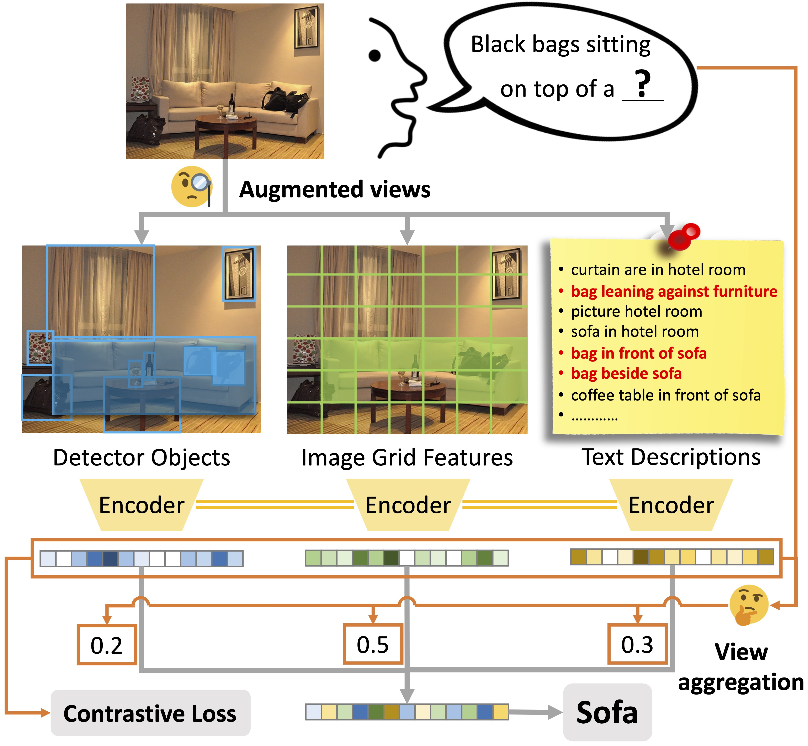

# HAAV: Hierarchical Aggregation of Augmented Views for Image Captioning

This is the official PyTorch implementation of our __CVPR 2023__ paper:
__HAAV: Hierarchical Aggregation of Augmented Views for Image Captioning__, by [Chia-Wen Kuo](https://sites.google.com/view/chiawen-kuo/home) and [Zsolt Kira](https://faculty.cc.gatech.edu/~zk15/).
[[arXiv](https://arxiv.org/abs/2305.16295)] [[Project](https://sites.google.com/view/chiawen-kuo/home/haav)] [[Video](https://www.youtube.com/watch?v=s9nq8T51Gs0)]

## Abstract

A great deal of progress has been made in image captioning, driven by research into how to encode the image using pre-trained models. This includes visual encodings (e.g. image grid features or detected objects) and more recently textual encodings (e.g. image tags or text descriptions of image regions). As more advanced encodings are available and incorporated, it is natural to ask: how to efficiently and effectively leverage the heterogeneous set of encodings? In this paper, we propose to regard the encodings as augmented views of the input image. The image captioning model encodes each view independently with a shared encoder efficiently, and a contrastive loss is incorporated across the encoded views in a novel way to improve their representation quality and the model’s data efficiency. Our proposed hierarchical decoder then adaptively weighs the encoded views according to their effectiveness for caption generation by first aggregating within each view at the token level, and then across views at the view level. We demonstrate significant performance improvements of +5.6% CIDEr on MS-COCO and +12.9% CIDEr on Flickr30k compared to state of the arts, and conduct rigorous analyses to demonstrate the importance of each part of our design.



## Repo Structure

HAAV is a follow-on work of our [Xmodal-Ctx](https://github.com/GT-RIPL/Xmodal-Ctx), which proposed to incorporate cross-modal context for image captioning. This codebase is thus built upon Xmodal-Ctx.

Please first follow the instructions in the [`ctx`](./ctx) folder to download or re-build the cross-modal visual and textual context, and then move on to the [`haav`](./haav) folder to train the image captioning model.

- The [`ctx`](./ctx) folder contains code for downloading or re-building the cross-modal visual and textual context.

- The [`haav`](./haav) folder contains code for training our HAAV image captioning model that leverages cross-modal visual and textual context in an efficient and effective way.

## Installation

This project is developed and tested with `Python==3.8` and `PyTorch==1.10`.

```bash
# create a conda env
conda env create -f environment.yml
conda activate xmodal-ctx

# Download spacy English data
python -m spacy download en_core_web_sm
```

## Citations

```BibTeX
@inproceedings{kuo2023hierarchical,
    title={HAAV: Hierarchical Aggregation of Augmented Views for Image Captioning},
    author={Chia-Wen Kuo and Zsolt Kira},
    booktitle={Proceedings of the IEEE/CVF Conference on Computer Vision and Pattern Recognition},
    year={2023}
}
```

```BibTeX
@inproceedings{kuo2022pretrained,
    title={Beyond a Pre-Trained Object Detector: Cross-Modal Textual and Visual Context for Image Captioning},
    author={Chia-Wen Kuo and Zsolt Kira},
    booktitle={Proceedings of the IEEE/CVF Conference on Computer Vision and Pattern Recognition},
    year={2022}
}
```
